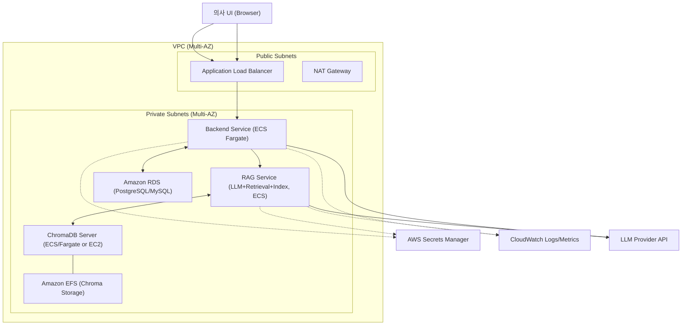
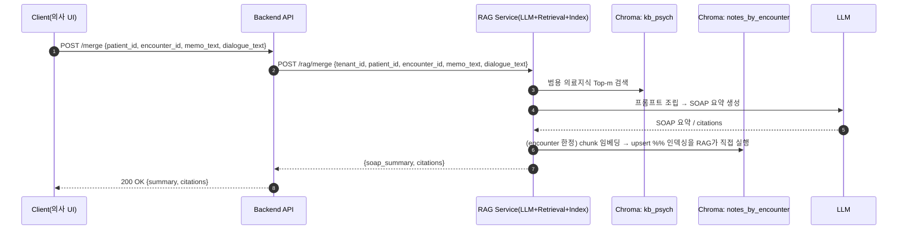
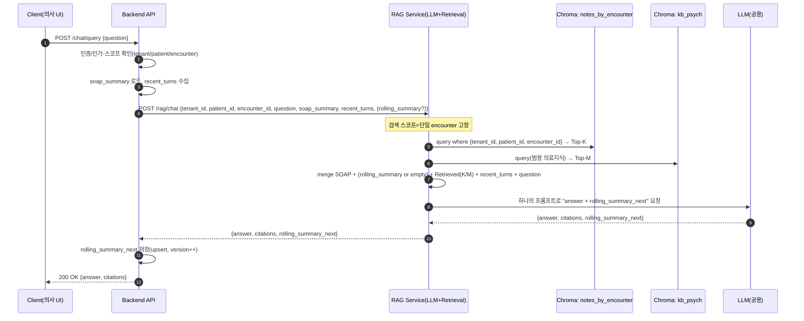

# RAG Service - Clean Architecture

## ⚠️ 중요: 개발 범위
**RAG 서비스(/rag/*)만 개발합니다. Backend 서비스는 다른 개발자가 담당하므로 절대 수정하지 않습니다.**

## 📁 프로젝트 구조

```
app/rag/
├── domain/                  # 도메인 레이어 (비즈니스 엔티티, 규칙)
│   ├── entities.py         # 핵심 엔티티 (MedicalEncounter, SOAPNote, etc.)
│   └── repositories.py     # 레포지토리 인터페이스 (추상화)
│
├── application/            # 애플리케이션 레이어 (유스케이스)
│   ├── use_cases.py       # 비즈니스 유스케이스
│   └── services.py        # 애플리케이션 서비스 (ChunkingService)
│
├── infrastructure/         # 인프라 레이어 (외부 시스템 구현)
│   ├── vector_store.py    # ChromaDB 구현
│   ├── embedding.py       # HuggingFace 임베딩 구현
│   ├── llm.py            # LLM 서비스 구현
│   └── config.py         # 환경 설정
│
├── presentation/          # 프레젠테이션 레이어 (API)
│   ├── api.py            # FastAPI 엔드포인트
│   ├── schemas.py        # Request/Response 스키마
│   └── dependencies.py   # 의존성 주입
│
└── main.py               # FastAPI 앱 진입점
```

## 🏗️ Clean Architecture 원칙

### 의존성 규칙
- 의존성은 항상 **안쪽으로만** 향함: Presentation → Infrastructure → Application → Domain
- 내부 레이어는 외부 레이어를 모름

### 레이어별 책임
- **Domain**: 비즈니스 엔티티와 규칙 (외부 의존성 없음)
- **Application**: 유스케이스와 비즈니스 로직
- **Infrastructure**: 외부 시스템 통합 (ChromaDB, LLM, 임베딩)
- **Presentation**: API 엔드포인트와 요청/응답 처리

# **시스템 아키텍처**



## **1) 역할 분리**

- **App Backend**
    - CRUD/권한, RDS 접근
    - /rag/merge 결과 저장, /rag/chat의 rolling_summary_next 저장
    - **재색인 트리거는 /rag/reindex 호출(동기 처리, 큐 없음)**
- **RAG Service**
    - 공용 LLM 호출, 컨텍스트 패킹, 검색 오케스트레이션
    - **인덱싱(Chunk→Embed→Chroma upsert)까지 직접 수행**
    - VectorDB(Chroma) 읽기/쓰기, DB 직접 접근 없음
- **Vector Store**
    - Chroma(서버 모드) + EFS/EBS

## **2) 호출 경로**

1. **POST /merge** (Client → Backend)
2. **Backend → RAG: /rag/merge** *(inline: conversation, doctor_note)*
3. **RAG**: kb_psych 조회 → **LLM으로 SOAP 생성** → **즉시 인덱싱(chunk→embed→Chroma upsert)** → **SOAP 반환**
4. **Backend**: SOAP **DB UPSERT** (encounters, version++)
5. *(선택)* **POST /rag/reindex** (Backend → RAG)
    - 필요 시(예: 수동 재색인/버전 불일치) 호출 → **RAG가 즉시 인덱싱** 후 {status:"indexed"} 응답
6. **POST /chat/query** (Client → Backend)
7. **Backend → RAG: /rag/chat** *(필수: ids, question, recent_turns / 선택: rolling_summary, expected_version)*
8. **RAG**:
    - expected_version 있으면 **Chroma 버전 확인 → 부족 시 내부 재색인 수행**
    - **단일 encounter 스코프**로 notes Top-K + kb_psych Top-M 조회
    - **LLM 한 번 호출**로 answer + citations + rolling_summary_next 생성
9. **Backend**: rolling_summary_next **저장** → 응답 반환

## **3) 왜 이렇게 나누나?**

- **보안/경계 유지**
    - 트랜잭션 DB는 **Backend 전용**, RAG는 **검색/생성/인덱싱만** 담당 → 권한/감사 단순.
- **간결성 (토이 친화)**
    - **S3/SQS/별도 Indexer 제거** → 컴포넌트 축소, 배포/운영 난이도↓.
    - /rag/merge와 /rag/reindex에서 **RAG가 즉시 인덱싱** → 흐름 명확.
- **정확성**
    - 검색 스코프를 **단일 encounter**로 강제(tenant_id+patient_id+encounter_id) → 교차 환자/과거 노출 차단.
    - /rag/chat에서 expected_version로 **구버전 인덱스 방지**(필요 시 RAG가 내부 재색인).
- **성능/비용**
    - **LLM 단일 호출**로 답변 + rolling summary 동시 생성 → 토큰/지연/비용 최적.
    - 긴 SOAP는 **Top-K 문단만 컨텍스트**로 넣어 토큰 절약.
- **운영성**
    - 재색인은 **해당 encounter만** 대상 → 빠르고 간단.
    - 필요 시에만 /rag/reindex 호출(동기) → 구현/관찰 쉬움.

# **AWS 배치 예시**

- **ALB → ECS Fargate**
    - backend-service (VPC 프라이빗, RDS)
    - rag-service (VPC 프라이빗, **Chroma 접속**)
- **RDS**: 환자/의사/encounters/rolling_summaries
- **Chroma on ECS + EFS(KMS)**: 벡터 스토어
- **Secrets Manager / CloudWatch Logs**
- **보안그룹**
    - ALB:443 → Backend (필요 시 RAG는 내부 전용)
    - Backend → RDS
    - Backend → RAG(내부 gRPC/HTTP)
    - RAG ↔ Chroma **8000/tcp**
    - Chroma ↔ EFS **2049/tcp**

# 시퀀스 다이어그램

## **1) /rag/merge (상담요약 생성 & 재색인 트리거)**



- 요청

    ```json
    {
      "tenant_id": "hospA",
      "patient_id": "p123",
      "encounter_id": "e789",

      "paragraph": [
        {
          "paragraph_speaker": "doctor",   // "doctor" | "patient"
          "paragraph_text": "어디가 불편하신가요?"
        },
        {
          "paragraph_speaker": "patient",
          "paragraph_text": "머리가 아프고 어지러워요."
        },
        {
          "paragraph_speaker": "doctor",
          "paragraph_text": "오늘 하루 어떠셨나요?"
        },
        {
          "paragraph_speaker": "patient",
          "paragraph_text": "그냥 머리 아픈 것 말고는 똑같았어요."
        }
      ],

      "doctor_note": "두통과 어지러움을 호소. 혈압 정상 범위. 신경학적 검사 특이사항 없음."
    }
    ```

- 응답

    ```json
    {
      "soap_summary": "S: 환자는 두통과 어지럼증을 호소함. ..."
    }
    ```


## 2) **/rag/chat (질의응답, 최소 입력 + Top-K 검색)**



- 요청

    ```json
    {
      "tenant_id": "hospA",
      "patient_id": "p123",
      "encounter_id": "e789",
      "question": "무슨 약 복용 중이었지?",
      "recent_turns": [
        {"role":"user","text":"저녁엔 약을 안 먹었어요"},
        {"role":"assistant","text":"언제부터 변경되었나요?"}
      ],
      "rolling_summary": "..." ,           // optional
      "expected_version": 3                // optional (있으면 버전 확인)
    }
    ```

- 응답

    ```json
    {
      "answer": "상담노트에는 sertraline 50mg qAM 복용으로 기재되어 있습니다.",
      "rolling_summary_next": "의사와 AI는 환자의 증상을 확인하며 최근 약 복용 패턴을 점검 중임"
    }
    ```


→ summary까지 넣으면 너무 복잡하니까 일단 전체 턴 전달하는거로 구현. summary는 추후 다시 논의 후 추가하거나 제외

## 3) /rag/reindex

-

    ```mermaid
    sequenceDiagram
        autonumber
        participant BE as Backend API
        participant RAG as RAG Service(LLM+Retrieval+Index)
        participant NOTES as Chroma: notes_by_encounter

        BE->>RAG: POST /rag/reindex {tenant_id, patient_id, encounter_id, version, soap_summary}
        RAG->>RAG: 검증/중복 체크(encounter_id:version)
        RAG->>NOTES: chunk 임베딩 → upsert
        RAG-->>BE: 200 {"status":"indexed","encounter_id":"...","version":...}
    ```

- **의도**: Backend가 특정 encounter의 상담노트(soap_summary)를 최신 상태로 **재색인**해달라고 요청
- **요청 바디(Inline, S3 없음)**

    ```json
    {
      "tenant_id": "hospA",
      "patient_id": "p123",
      "encounter_id": "e_789",
      "version": 3,
      "soap_summary": "S:... O:... A:... P:...",
      "idempotency_key": "reidx-e_789-v3"   // 선택(권장)
    }
    ```

- 응답

    ```json
    { "status": "indexed", "encounter_id": "e_789", "version": 3 }
    ```
